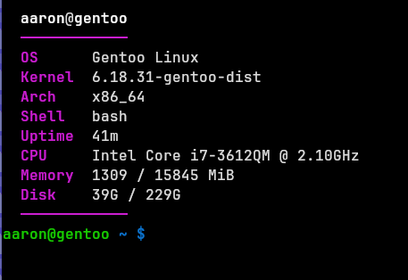

# `fetch`

---
the best tool for linux distributions because it only uses around 175 lines of pure c code.

###### vibecoded sadly

minimal  
fast  
tiny  
dependency free  

## features -

- pure c
- instant startup
- clean output
- tiny binary
- works on basically every linux distro
- no useless clutter
- no giant ascii art taking half your terminal

## example
###### used in low-end laptop down here:

─────
```
## installation
###### make sure cmake is installed properly!
```bash
  cd fetch
  make
  sudo make install
  sudo mv fetch /usr/local/bin
```
